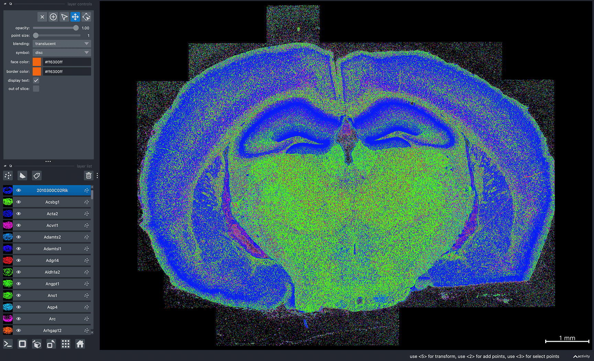
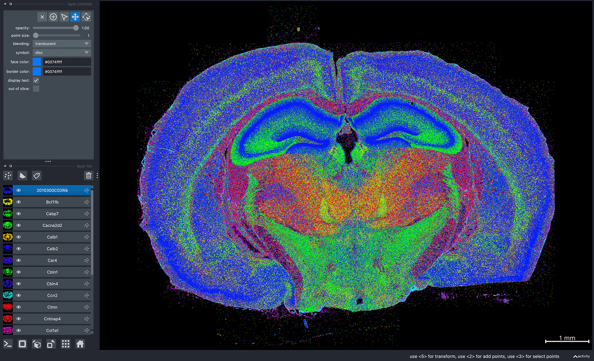

10x Genomics Xenium
===================

This tutorial is for visualizing 10x Genomics Xenium datasets. 

In order to visualize your Xenium dataset in Bella Vista, you will need to create a dataset-specific JSON configuration file containing paths to the Xenium outputs for your dataset. These output files will be processed to generate visualization files for Bella Vista. Creating these visualization files will take a few minutes but only need to be created once. For subsequent runs, `create_inputs` can be set to `False`.

## Configuration JSON file structure

```{eval-rst}
.. code-block:: JSON

    { 
        "system": "xenium", 
        "data_folder": "/path/to/Xenium_dataset_outs",
        "bella_vista_output_folder": "/path/to/Xenium_dataset_outs/bellavista_outs",
        "create_bellavista_inputs": true,

        "visualization_parameters": {
            "plot_image": true,
            "plot_transcripts": true,
            "plot_allgenes": true,
            "plot_cell_seg": true
        },

        "input_files": {
            "transcript_filename": "transcripts.parquet",
            "images": "morphology.ome.tif",
            "z_plane": 0,
            "cell_segmentation": "cell_boundaries.parquet",
            "nuclear_segmentation": "nucleus_boundaries.parquet"
        }
    }
```

## Input file parameters (Xenium)


**transcript_filename**: *string*
: relative path to a Parquet or CSV file containing transcript spatial locations. If None, no transcripts will be prepared

**images**: *string or 1D array of strings*
: relative path to image file(s). Must be an OME-TIFF or TIFF file. If None, no images will be displayed

**z_plane**: *integer, default=0*
: z-plane of image to be used

**cell_segmentation**: *string*
: relative path to Parquet or Zarr file containing cell segmentations. If None, no cell segmentations will be prepared

**nuclear_segmentation**: *string*
: relative path to Parquet or Zarr file containing nuclear segmentations. If None, no nuclear segmentations will be prepared

```{eval-rst}
.. important::

  All input file paths **must** be relative paths to :samp:`data_folder`

```
```{eval-rst}
.. note::
  If you are missing some input files, remove those input file parameters from the JSON file. Bella Vista will skip the visualization of these data.

  For example, if you do not have nuclear segmentations, the input file parameters in your JSON file might look like this: 

  .. code-block:: JSON

          "input_files": {
              "transcript_filename": "transcripts.parquet",
              "images": "morphology.ome.tif",
              "z_plane": 0,
              "cell_segmentation": "cell_boundaries.parquet"
          }
```

## General parameters

**system**: *string*
: Value: `"Xenium"`\
 The input is not case-sensitive, so values "xenium", "Xenium", and "XENIUM" are treated equivalently

**data_folder**: *string*
: Path to folder containing dataset output files
  
**bella_vista_output_folder**: *string*
: Path to save & load Bella Vista visualization files
  
**create_bellavista_inputs**: *boolean, default=true*
: Create required visualization files for Bella Vista. Must be `true` when first loading data.\
 Can be `false` in subsequent runs (since files have already been created)

## Visualization parameters

**plot_image**: *boolean, default=False*
: Display image(s). Default value is False

**plot_transcripts**: *boolean, default=False*
: Plot gene transcript spatial coordinates

**plot_allgenes**: *boolean, default=True*
: Plot transcripts for all gene IDs. If False, only gene IDs in `selected_genes` will be plotted

**selected_genes**: *1D array of strings, default=None*
: Plot transcripts only for specified gene IDs

**plot_cell_seg**: *boolean, default=False*
: Plot cell segmentation

**plot_nuclear_seg**: *boolean, default=False*
: Plot nuclear segmentation

**transcript_point_size**: *float, default=1.0*
: Point size for plotting transcript coordinates

**contrast_limits**: *tuple array of integers, default=None*
: Values in the range [0, 65535]. Contrast limits for displayed image(s)

**rotate_angle**: *integer, default=None*
: Value in the range [0, 360]. Angle in degrees by which to rotate the data

<br><br>
<hr class="custom-line">

## Sample dataset & JSON

Download sample data: Xenium mouse brain dataset (replicate 3)
[https://www.10xgenomics.com/datasets/fresh-frozen-mouse-brain-replicates-1-standard](https://www.10xgenomics.com/datasets/fresh-frozen-mouse-brain-replicates-1-standard)

To download the dataset, 10x Genomics may ask you to fill out a questionnaire.


### Load Bella Vista

1. Download the sample JSON file from the GitHub repository: [BellaVista/sample_json/xenium_sample.json](https://github.com/pkosurilab/BellaVista/tree/main/sample_json/xenium_sample.json)
2. Replace the paths in `data_folder` and `bella_vista_output_folder`
<br><br>

**xenium_sample.json**
```{eval-rst}

.. code-block:: JSON
  :emphasize-lines: 3-4

  { 
      "system": "xenium", 
      "data_folder": "/path/to/xenium_brain_rep3",
      "bella_vista_output_folder": "/path/to/xenium_brain_rep3/bellavista_outs",
      "create_bellavista_inputs": true,

      "visualization_parameters": {
          "plot_image": true,
          "plot_transcripts": true,
          "plot_allgenes": true,
          "plot_cell_seg": false,
          "plot_nuclear_seg": false,
          "transcript_point_size": 0.75,
          "contrast_limits": [600, 3200],
          "rotate_angle": 180
      },

      "input_files": {
          "images": "morphology_mip.ome.tif",
          "z_plane": 5,
          "transcript_filename": "transcripts.parquet",
          "cell_segmentation": "cell_boundaries.parquet",
          "nuclear_segmentation": "nucleus_boundaries.parquet"
      }
  }
```

3. In the terminal, run Bella Vista with the Xenium sample JSON:
```{eval-rst}
.. code-block:: python

  bellavista xenium_sample.json
```

```{eval-rst}
.. note::

    It will take a few minutes to create the required data files. The terminal will print updates & have progress bars for time consuming steps.
```

Once successfully loaded, you should see the message `Data Loaded!` in the terminal.\
A napari window should appear displaying the data similar to the image below:



```{eval-rst}
.. note::

    Gene colors are assigned randomly every time Bella Vista is launched. So, the gene colors displayed in your window will be different from the image above. See :ref:`useful-napari-commands` in the FAQ for commands to configure gene colors and other customizable visualization options. 
    
    To reproduce the same colors every time you launch Bella Vista, see :ref:`creating-figures` in the Figure Guide.
```

Now, you can interactively move around the napari canvas to explore the data!\
Try zooming in & out, toggling layers on & off to see different spatial patterns:

<div style="position: relative; width: 100%; display: flex; justify-content: space-between; align-items: flex-end;">
  
  
</div>

For an exact reproduction of the two screenshots above, please refer to the figure guide: [Reproducing sample figures (Xenium)](../figure_guide.md#Reproducing-sample-figures-(Xenium))

## Visualizing your Xenium dataset

Steps to visualize your dataset:

1. Create and configure a JSON file for your dataset, ensuring all input file paths are relative to `data_folder`. Once this JSON file has been created, it can be reused every time you launch Bella Vista for this dataset.
2. Run Bella Vista with your configured JSON
3. Explore your data!

If you encounter any issues, please check the [FAQ](../faq.md#frequently-asked-questions). If you're experiencing issues not addressed in the FAQ, please check the open issues or [open a new issue](https://github.com/pkosurilab/BellaVista/issues)in our GitHub repository. You can also leave any feedback here!


<div class="flex justify-between items-center pt-6 mt-12 border-t border-border gap-4">
    <div class="mr-auto">
      <a href="../tutorials.html" class="inline-flex items-center justify-center rounded-md text-sm font-medium transition-colors border border-input hover:bg-accent hover:text-accent-foreground py-2 px-4" style="text-decoration: none;">
        <svg xmlns="http://www.w3.org/2000/svg" width="24" height="24" viewBox="0 0 24 24" fill="none" stroke="currentColor" stroke-width="2" stroke-linecap="round" stroke-linejoin="round" class="mr-2 h-4 w-4">
          <polyline points="15 18 9 12 15 6"></polyline>
        </svg>
        Tutorials
      </a>
    </div>
  <div class="ml-auto">
    <a href="../figure_guide.html" class="inline-flex items-center justify-center rounded-md text-sm font-medium transition-colors border border-input hover:bg-accent hover:text-accent-foreground py-2 px-4" style="text-decoration: none;">
      Figure Guide
      <svg xmlns="http://www.w3.org/2000/svg" width="24" height="24" viewBox="0 0 24 24" fill="none" stroke="currentColor" stroke-width="2" stroke-linecap="round" stroke-linejoin="round" class="ml-2 h-4 w-4">
        <polyline points="9 18 15 12 9 6"></polyline>
      </svg>
    </a>
  </div>
</div>