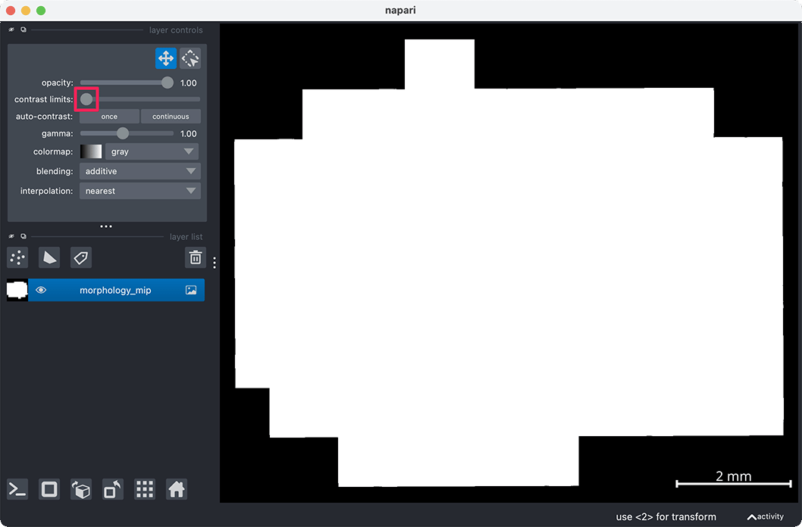
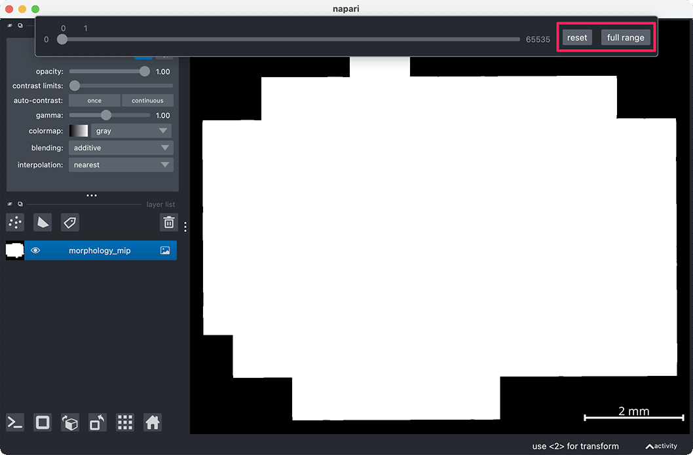
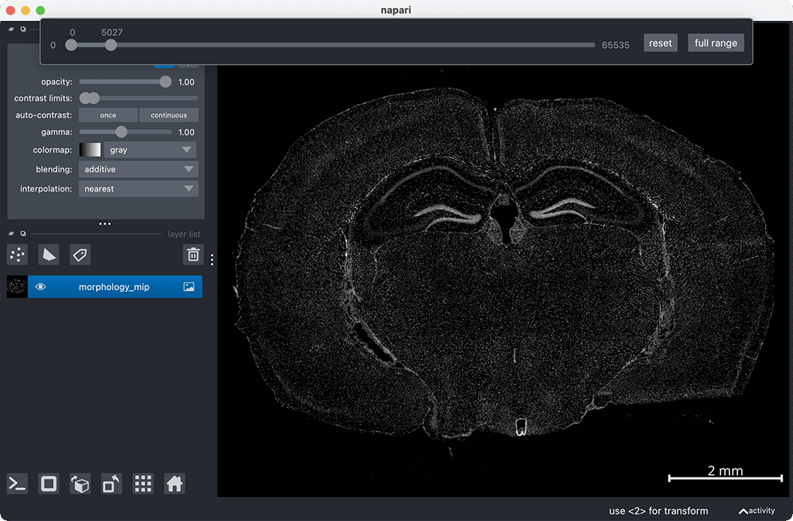

```{toctree}
:hidden: true
```
# {octicon}`question` FAQ

Here, you will find useful napari commands and answers to frequently asked questions. If you have suggestions for additional commands that others might find helpful or if you're encountering issues not covered in the FAQ, please check the open issues or [open a new issue](https://github.com/pkosurilab/BellaVista/issues) in the GitHub repository.

(useful-napari-commands)=
## Useful napari tools & commands


(faq)=
## Frequently Asked Questions
:::{dropdown} I cannot see my image
If your image has loaded, but appears oversaturated (white), you may need to change the contrast limits of the image.
<br><br>

**Right click the contrast limit slider**

<br><br>
**Select the `full range` button**

<br><br>

**Click on the right of the slider bar to increase the upper contrast limit. Now you can drag the sliders left and right to change the contrast limits**

<br><br>

<video width="640" height="360" controls>
       <source src="_static/faq/oversaturated_image.mp4" type="video/mp4">
</video>

### Contrast limits can also be changed in the napari console with the following syntax:

```{eval-rst}
.. code-block:: python

   # change "morphology_mip" to the name of your image layer
   viewer.layers["morphology_mip"].contrast_limits = [0, 5027]
```
<br><br>
**Once you have determined your desired contrast limits, these can be passed into Bella Vista for future runs. Assign these limits to the `contrast_limits` visualization parameter for future runs!**
<br><br>
[Visualization parameter documentation](./get_started.md#visualization-parameters)
:::

<!-- <a id="reducing-memory-requirements"></a>

<!-- ## Reducing Memory Requirements -->

<!-- (test)=

:::{dropdown} What should I do if the program runs out of memory?

:::

.. _reducing_memory_requirements:

:::{dropdown} Reducing Memory Requirements
:name: test
If the program crashes or encounters a memory-related error, you may need to visualize a smaller subset of the data.
For more information, see the FAQ section.

:::

{ref}`test` -->


<a id="reducing-memory-requirements"></a>

:::{dropdown} What should I do if the program runs out of memory?

If the program crashes or encounters a memory-related error, you may need to visualize a smaller subset of the data.
For more information, see the FAQ section.

:::