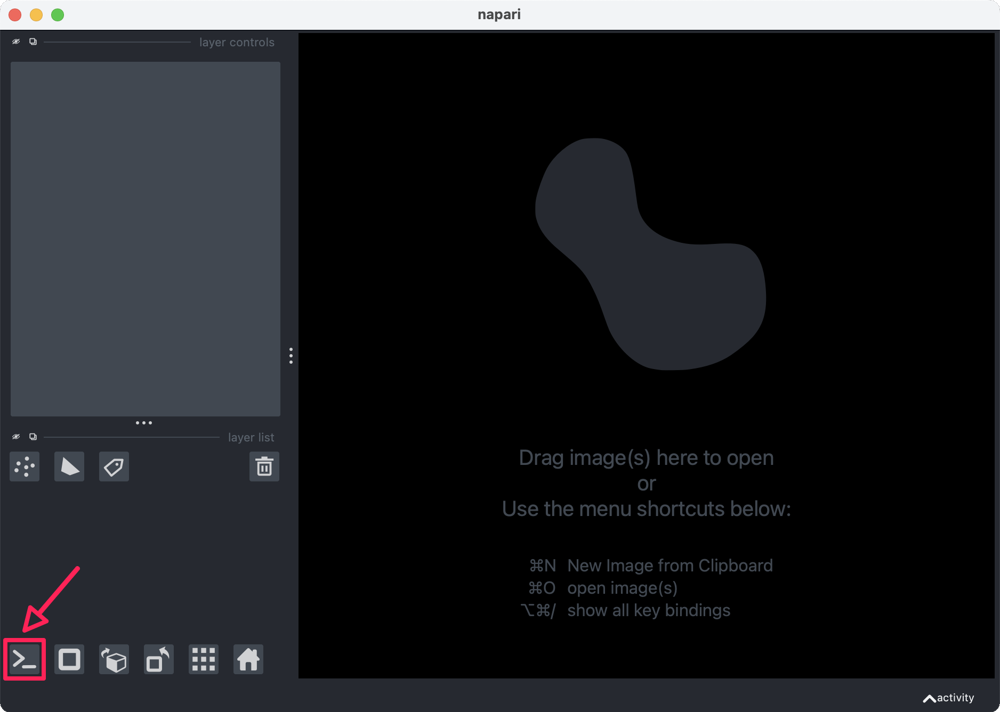
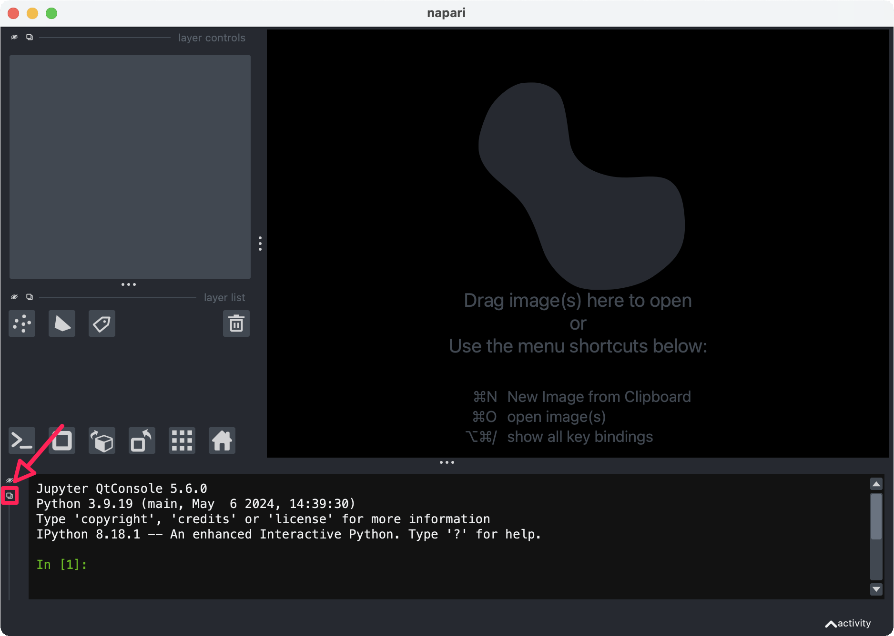
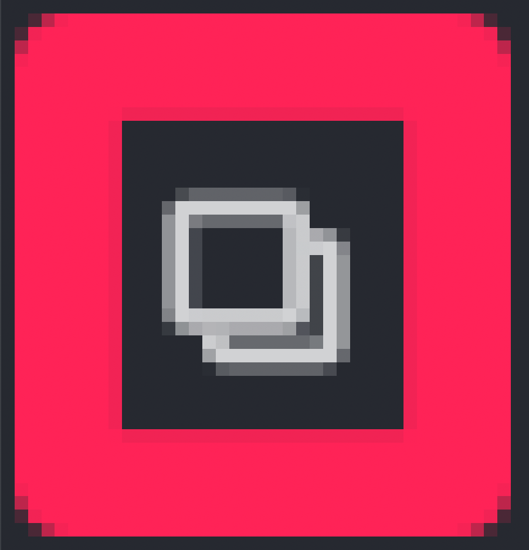
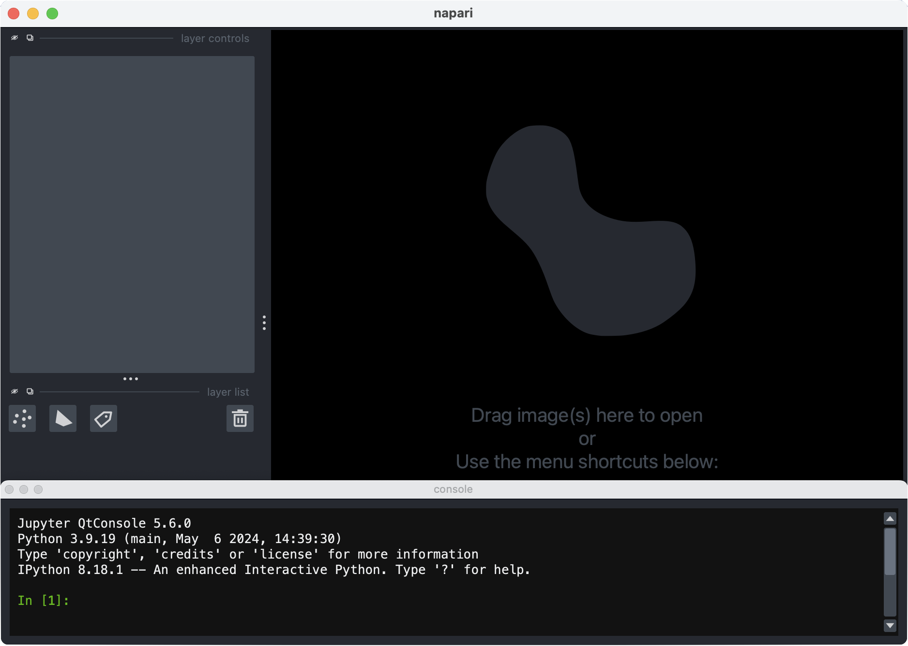
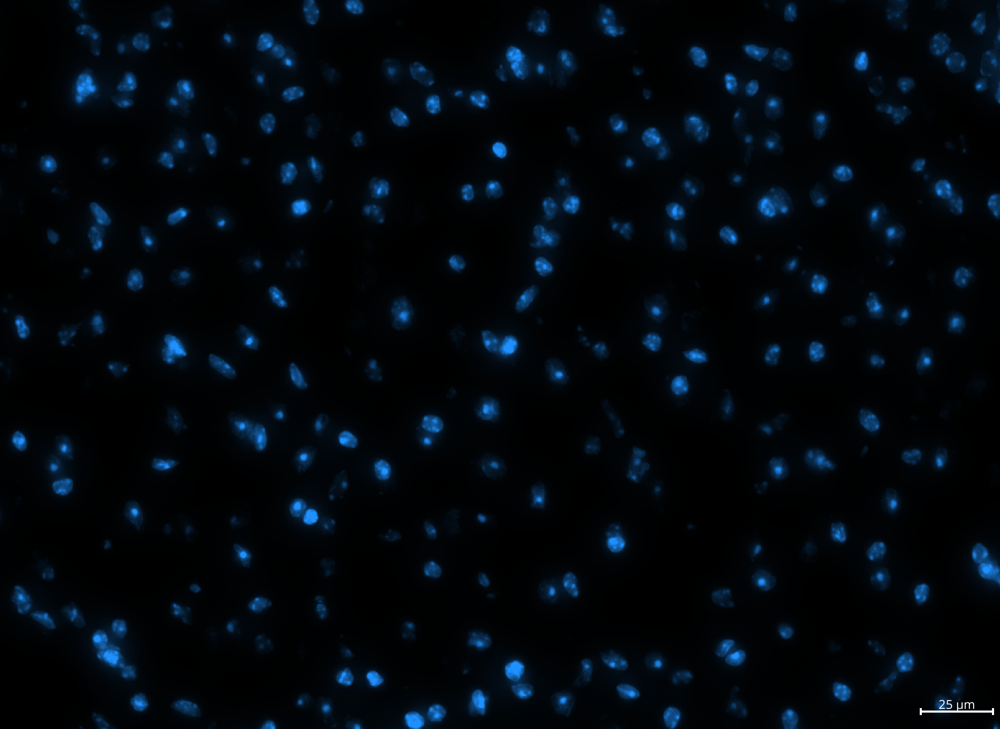
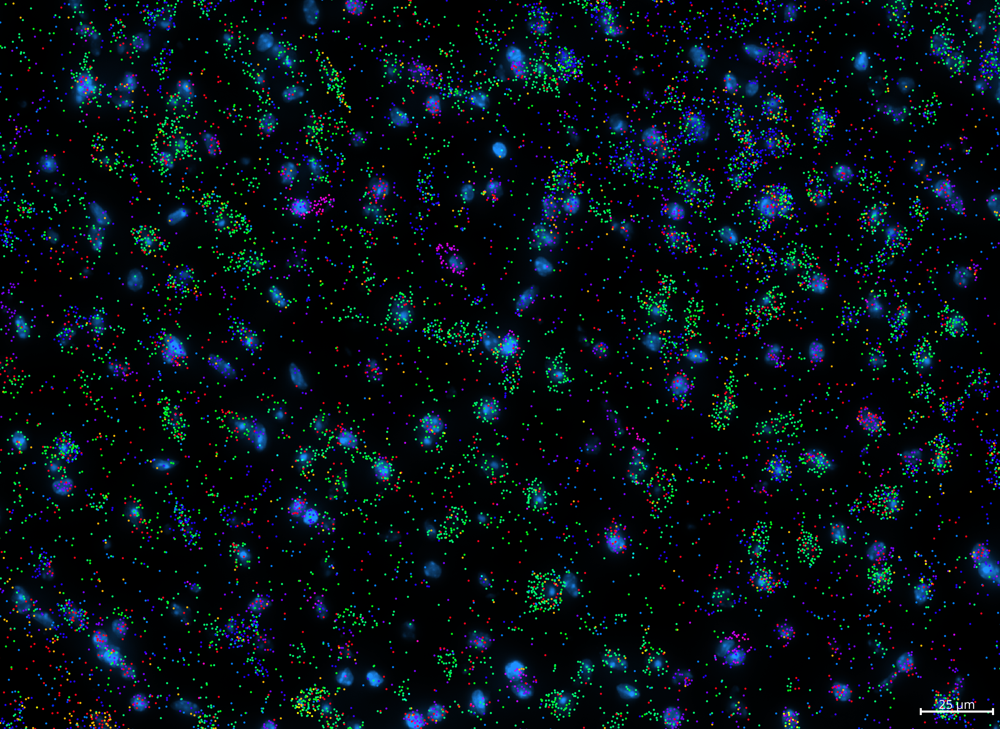

```{toctree}
:hidden: true
```
# {octicon}`pencil` Figure Guide

Bella Vista can be used to create poster, presentation, and paper-ready figures highlighting spatial discoveries in your data. Figures can also be reproduced between different sessions, different computers, and different users.

## Reproducing sample figures (Xenium)

Below is a step-by-step guide to reproducing the following screenshots from a sample Xenium dataset:

<div style="position: relative; width: 100%; display: flex; justify-content: space-between; align-items: flex-end;">
  
  
</div>

The sample dataset can be downloaded here: [Xenium mouse brain dataset (replicate 3)](https://www.10xgenomics.com/datasets/fresh-frozen-mouse-brain-replicates-1-standard)\
To download the dataset, 10x Genomics may ask you to fill out a questionnaire.


[https://www.10xgenomics.com/datasets/fresh-frozen-mouse-brain-replicates-1-standard](https://www.10xgenomics.com/datasets/fresh-frozen-mouse-brain-replicates-1-standard)
<br/><br/>


Configuration files can be found in the [dropbox here](https://www.dropbox.com/scl/fo/5ae35p7nbkct0e0mi92vz/AD38rhAb4M6L36putA4qREU?rlkey=hjnf94fomm5k2rfyzyi7b58u3)


 ```{eval-rst}
.. note::

    When taking screenshots on different computers, the content visible may be different due to different display sizes
```

### Load Bella Vista

- Copy and save contents below into a new JSON file called `sample_figure_xenium_brain.json`
- This sample JSON can also be found in the dropbox folder
- Replace the paths in `data_folder` and `bella_vista_output_folder` parameters 

```{eval-rst}
.. code-block:: JSON
  :emphasize-lines: 3-4

  { 
    "system": "xenium", 
    "data_folder": "/path/to/xenium_brain_rep3",
    "bella_vista_output_folder": "/path/to/xenium_brain_rep3/bellavista_outs",
    "create_bellavista_inputs": true,

    "visualization_parameters": {
        "plot_image": true,
        "plot_transcripts": true,
        "plot_allgenes": false,
        "selected_genes": ["Igfbp5","Igf2","Gjc3","Gad2","Epha4","Dner","Dkk3",
                            "Col1a1","Cntnap4","Clmn","Ccn2","Cbln4","Cbln1",
                            "Car4","Calb2","Calb1","Cacna2d2","Cabp7","Bcl11b",
                            "2010300C02Rik"],
        "transcript_point_size": 0.75,
        "contrast_limits": [0, 5000],
        "rotate_angle": 180
    },
    
    "input_files": {
        "images": "morphology_mip.ome.tif",
        "z_plane": 5,
        "transcript_filename": "transcripts.parquet"
    }
  }
```

In the terminal, run Bella Vista with the Xenium sample JSON:
```{eval-rst}
.. code-block:: python

  bellavista sample_figure_xenium_brain.json
```

**Note**: It will take a few minutes to create the required data files.\
The terminal will print updates & have progress bars for time consuming steps.

Once loaded, your napari window should look similar to this. The gene colors displayed will be different, but we'll reassign those later!

<p align="center">
  <picture>
    
  </picture>
</p>
<p align="center">

Now that the data has loaded, we can start configuring it to reproduce the example figures. These next steps will all be done in the napari console.

### Using the napari console

To take screenshots and save current layer configurations, you can use the napari console.\
The napari console can be found in the bottom left of the gui:

<p align="center">
  <picture>
    
  </picture>
</p>
<p align="center">

**Note:** To maximise content visible in the canvas, open the console in a separate window:

<div style="position: relative; width: 100%; display: flex; justify-content: space-between; align-items: flex-end;">
  
  
</div>

<p align="center">
  <picture>
    
  </picture>
</p>
<p align="center">

### Change settings to match example configuration

#### 1. Change folder paths
```{eval-rst}
.. code-block:: python

    import os 
    import pickle

    #path to folder containing configuration files
    pkl_dir = '/path/to/BellaVista_Xenium_sample_figure'

    #path to save folder
    screenshot_dir = '/path/to/BellaVista_Xenium_sample_figure/user_screenshots'

    if not os.path.exists(screenshot_dir):
        os.makedirs(screenshot_dir)
```

#### 2. Assign gene colors
```{eval-rst}
.. code-block:: python

    with open(os.path.join(pkl_dir, 'xenium_brain_gene_colors_dict.pkl'), 'rb') as f:
        gene_colors_dict = pickle.load(f)
    for gene in gene_colors_dict.keys():
        viewer.layers[gene].face_color = gene_colors_dict[gene]
```

#### 3. Change colormap for DAPI image
```{eval-rst}
.. code-block:: python

    image_layers = [layer for layer in viewer.layers if isinstance(layer, napari.layers.Image)]
    for layer in image_layers:
        layer.colormap = 'dodgerblue'
        layer.gamma = 1.6
```

#### 4. Take zoomed out screenshot
```{eval-rst}
.. code-block:: python

    with open(os.path.join(pkl_dir, 'xenium_brain_position_0.pkl'), 'rb') as f:
        position_0 = pickle.load(f)
    viewer.camera.center, viewer.camera.zoom = position_0['center'], position_0['zoom']
    viewer.screenshot(os.path.join(screenshot_dir, 'xenium_brain_position_0.png'))
```

<p align="center">
  <picture>
    
  </picture>
</p>
<p align="center">

#### 5. Zoom in
```{eval-rst}
.. code-block:: python

    with open(os.path.join(pkl_dir, 'xenium_brain_position_1.pkl'), 'rb') as f:
        position_1 = pickle.load(f)
    viewer.camera.center, viewer.camera.zoom = position_1['center'], position_1['zoom']
    viewer.screenshot(os.path.join(screenshot_dir, 'xenium_brain_position_1.png'))
```

<p align="center">
  <picture>
    
  </picture>
</p>
<p align="center">

#### 6. Toggle off visibility of gene layers, leaving only DAPI visible
```{eval-rst}
.. code-block:: python

    for layer in viewer.layers:
        if isinstance(layer, napari.layers.Image):
            layer.visible=True
        else:
            layer.visible=False
    viewer.screenshot(os.path.join(screenshot_dir, 'xenium_brain_position_1_DAPI.png'))
```

<p align="center">
  <picture>
    
  </picture>
</p>
<p align="center">

#### 6. Zoom in further
```{eval-rst}
.. code-block:: python

    with open(os.path.join(pkl_dir, 'xenium_brain_position_2.pkl'), 'rb') as f:
        position_2 = pickle.load(f)
    viewer.camera.center, viewer.camera.zoom = position_2['center'], position_2['zoom']
    viewer.screenshot(os.path.join(screenshot_dir, 'xenium_brain_position_2_DAPI.png'))
```

<p align="center">
  <picture>
    
  </picture>
</p>
<p align="center">

#### 7. Toggle visibility of all layers on 
```{eval-rst}
.. code-block:: python

    for layer in viewer.layers:
        layer.visible=True
    viewer.screenshot(os.path.join(screenshot_dir, 'xenium_brain_position_2.png'))
```

<p align="center">
  <picture>
    
  </picture>
</p>
<p align="center">

<br><br>
<hr class="custom-line">

(creating-figures)=
## Creating your own figures!

(useful-figure-commands)=
### Useful commands

Screenshot current canvas:
```{eval-rst}
.. code-block:: python

    # save screenshot to folder
    viewer.screenshot("/path/to/folder/napari_canvas.png")
```

Save current camera position & zoom:
```{eval-rst}
.. code-block:: python

    import pickle

    # save current camera state
    position_1 = {'center': viewer.camera.center, 'zoom': viewer.camera.zoom}
    with open('/path/to/folder/position_1.pkl', 'wb') as f:
        pickle.dump(position_1, f)
```
Return to saved position:
```{eval-rst}
.. code-block:: python

    import pickle 

    # load previous camera state
    with open('/path/to/folder/position_1.pkl', 'rb') as f:
        position_1 = pickle.load(f)

    # return to camera state from previous screenshot
    viewer.camera.center, viewer.camera.zoom = position_1['center'], position_1['zoom']
```

Save transcript colors for each gene:
```{eval-rst}
.. code-block:: python

    import pickle 

    # store current transcript colors in a dictionary
    gene_colors_dict = {}
    gene_layers = [layer for layer in viewer.layers if isinstance(layer, napari.layers.Points)]
    for gene_layer in gene_layers:
        gene_colors_dict[gene_layer.name] = gene_layer.face_color[0]

    # save dictionary
    with open('/path/to/folder/gene_colors_dict.pkl', 'wb') as f:
        pickle.dump(gene_colors_dict, f)
```

Load saved transcript colors:
```{eval-rst}
.. code-block:: python

    import pickle

    # load saved transcript colors
    with open('/path/to/folder/gene_colors_dict.pkl', 'rb') as f:
        gene_colors_dict = pickle.load(f)

    # assign gene transcript point colors
    for gene in gene_colors_dict.keys():
        viewer.layers[gene].face_color = gene_colors_dict[gene]
```

