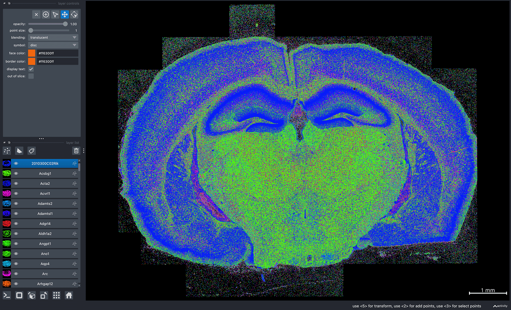
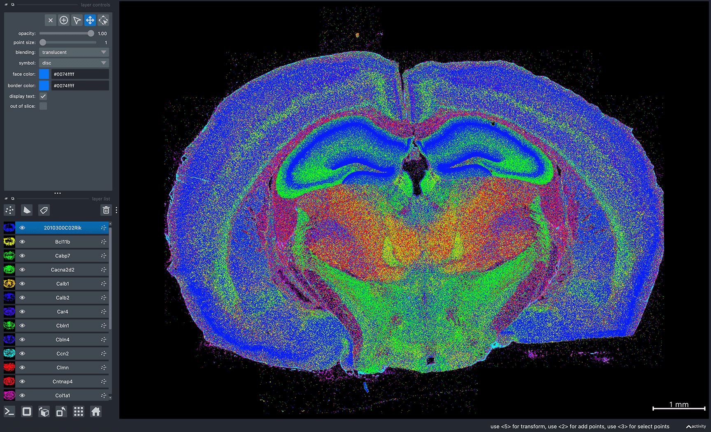
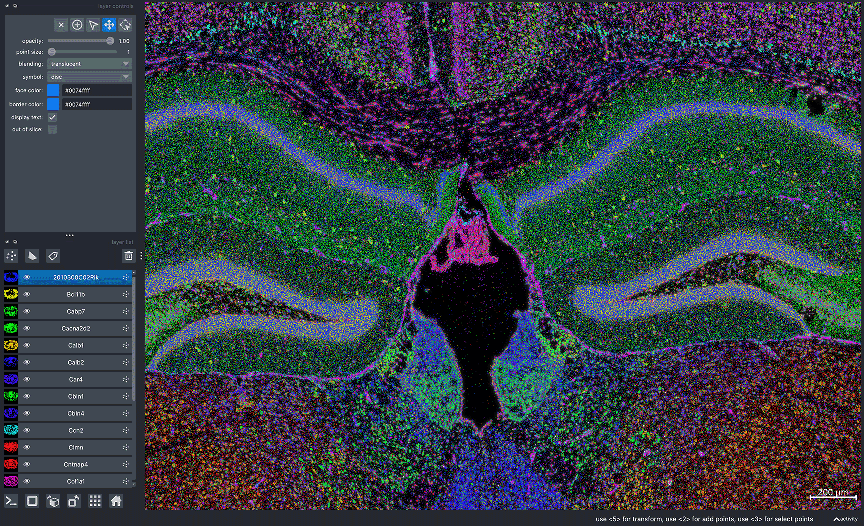

```{toctree}
:hidden: true
```
# {octicon}`rocket` Getting Started

To visualize data in Bella Vista, you need a JSON configuration file containing dataset-specific parameters.

## Configuration JSON file structure

```{eval-rst}
.. code-block:: JSON

  {
    "system": "spatial_technology",
    "data_folder": "/path/to/dataset",
    "bella_vista_output_folder": "path/to/dataset/bellavista_outs",
    "create_bellavista_inputs": true,
    
    "visualization_parameters": {
        "plot_image": true,
        "plot_transcripts": true,
        "plot_cell_seg": true
    },
  
    "input_files": {
        "images": "image_filename.tif",
        "transcript_filename": "transcript_filename",
        "cell_segmentation": "cell_seg_filename"
    }
  } 
```

## General parameters

**system**: *string*
: Allowed values: `"Xenium"`, `"MERSCOPE"`, or `"MERlin"`. Specifies the spatial transcriptomic technology. The input is not case-sensitive, so values "xenium", "Xenium", and "XENIUM" are treated equivalently

**data_folder**: *string*
: Path to folder containing dataset output files
  
**bella_vista_output_folder**: *string*
: Path to save & load Bella Vista visualization files
  
**create_bellavista_inputs**: *boolean, default=true*
: Create required visualization files for Bella Vista. Must be `true` when first loading data.\
 Can be `false` in subsequent runs (since files have already been created)


## Visualization parameters

**plot_image**: *boolean, default=false*
: Display image(s)

**plot_transcripts**: *boolean, default=false*
: Plot gene transcript spatial coordinates

**plot_allgenes**: *boolean, default=true*
: Plot transcripts for all gene IDs. If false, only gene IDs in `selected_genes` will be plotted

**selected_genes**: *1D array of strings, default=None*
: Only plot transcripts for gene IDs specified in list. If None, all genes will be plotted by default

**plot_cell_seg**: *boolean, default=false*
: Plot cell segmentation

**plot_nuclear_seg**: *boolean, default=false*
: Plot nuclear segmentation

**transcript_point_size**: *float, default=1.0*
: Point size for individual transcript coordinates

**contrast_limits**: *tuple array of integers, default=None*
: Values in the range [0, 65535]. Contrast limits for displayed image(s)

**rotate_angle**: *integer, default=None*
: Value in the range [0, 360]. Angle in degrees by which to rotate the data

## Input file parameters

Each technoloy has technology-specific input file requirements. Technology-specific input file parameters and example JSON files can be found in the [Xenium](bellavista_tutorials/10x_xenium), [MERSCOPE](bellavista_tutorials/vizgen_merscope), [MERlin](bellavista_tutorials/merfish_merlin) tutorials. 


## Getting Started

Step-by-step tutorials for each technology:

::::{grid} 2

:::{grid-item-card}  10x Genomics Xenium
:width: auto
:link: bellavista_tutorials/10x_xenium.html

Step-by-step guide to visualizing Xenium datasets
:::

:::{grid-item-card}  Vizgen MERSCOPE
:width: auto
:link: bellavista_tutorials/vizgen_merscope.html

Step-by-step guide to visualizing MERSCOPE datasets
:::

:::{grid-item-card}  MERFISH - MERlin
:width: auto
:link: bellavista_tutorials/merfish_merlin.html

Step-by-step guide to visualizing MERFISH datasets processed via the MERlin pipeline
:::
::::
<br>
<hr class="custom-line">

### Getting Started (with sample data)

Below is a short tutorial for loading Bella Vista with sample Xenium data. This tutorial can also be found in the [Xenium tutorial page](bellavista_tutorials/10x_xenium)

#### Sample dataset & JSON

Download sample data: Xenium mouse brain dataset (replicate 3)
[https://www.10xgenomics.com/datasets/fresh-frozen-mouse-brain-replicates-1-standard](https://www.10xgenomics.com/datasets/fresh-frozen-mouse-brain-replicates-1-standard)

To download the dataset, 10x Genomics may ask you to fill out a questionnaire.


#### Load Bella Vista

1. Download the sample JSON file from the GitHub repository: [BellaVista/sample_json/xenium_sample.json](https://github.com/pkosurilab/BellaVista/tree/main/sample_json/xenium_sample.json)
2. Replace the paths in `data_folder` and `bella_vista_output_folder`
<br><br>

**xenium_sample.json**
```{eval-rst}

.. code-block:: JSON
  :emphasize-lines: 3-4

  { 
      "system": "xenium", 
      "data_folder": "/path/to/xenium_brain_rep3",
      "bella_vista_output_folder": "/path/to/xenium_brain_rep3/bellavista_outs",
      "create_bellavista_inputs": true,

      "visualization_parameters": {
          "plot_image": true,
          "plot_transcripts": true,
          "plot_allgenes": true,
          "plot_cell_seg": false,
          "plot_nuclear_seg": false,
          "transcript_point_size": 0.75,
          "contrast_limits": [600, 3200],
          "rotate_angle": 180
      },

      "input_files": {
          "images": "morphology_mip.ome.tif",
          "z_plane": 5,
          "transcript_filename": "transcripts.parquet",
          "cell_segmentation": "cell_boundaries.parquet",
          "nuclear_segmentation": "nucleus_boundaries.parquet"
      }
  }
```

3. In the terminal, run Bella Vista with the Xenium sample JSON:
```{eval-rst}
.. code-block:: python

  bellavista xenium_sample.json
```

```{eval-rst}
.. note::

    It will take a few minutes to create the required data files. The terminal will print updates & have progress bars for time consuming steps.
```

```{eval-rst}
.. warning::

    If the program crashes or encounters a memory-related error, you may need to visualize a smaller subset of the data.
    For more information, see `What should I do if the program runs out of memory? <faq.html#reducing-memory-requirements>`_ in the FAQ.
```

{ref}

Once successfully loaded, you should see the message `Data Loaded!` in the terminal.\
A napari window should appear displaying the data similar to the image below:



```{eval-rst}
.. note::

    Gene colors are assigned randomly every time Bella Vista is launched. So, the gene colors displayed in your window will be different from the image above. See :ref:`useful-napari-commands` in the FAQ for commands to configure gene colors and other customizable visualization options. 
    
    To reproduce the same colors every time you launch Bella Vista, see :ref:`creating-figures` in the Figure Guide.
```

Now, you can interactively move around the napari canvas to explore the data!\
Try zooming in & out, toggling layers on & off to see different spatial patterns:

<div style="position: relative; width: 100%; display: flex; justify-content: space-between; align-items: flex-end;">
  
  
</div>

For an exact reproduction of the two screenshots above, please refer to the figure guide: [Reproducing sample figures (Xenium)](./figure_guide.md#Reproducing-sample-figures-(Xenium))


<div class="flex justify-between items-center pt-6 mt-12 border-t border-border gap-4">
    <div class="mr-auto">
      <a href="installation.html" class="inline-flex items-center justify-center rounded-md text-sm font-medium transition-colors border border-input hover:bg-accent hover:text-accent-foreground py-2 px-4" style="text-decoration: none;">
        <svg xmlns="http://www.w3.org/2000/svg" width="24" height="24" viewBox="0 0 24 24" fill="none" stroke="currentColor" stroke-width="2" stroke-linecap="round" stroke-linejoin="round" class="mr-2 h-4 w-4">
          <polyline points="15 18 9 12 15 6"></polyline>
        </svg>
        Installation
      </a>
    </div>
  <div class="ml-auto">
    <a href="tutorials.html" class="inline-flex items-center justify-center rounded-md text-sm font-medium transition-colors border border-input hover:bg-accent hover:text-accent-foreground py-2 px-4" style="text-decoration: none;">
      Tutorials
      <svg xmlns="http://www.w3.org/2000/svg" width="24" height="24" viewBox="0 0 24 24" fill="none" stroke="currentColor" stroke-width="2" stroke-linecap="round" stroke-linejoin="round" class="ml-2 h-4 w-4">
        <polyline points="9 18 15 12 9 6"></polyline>
      </svg>
    </a>
  </div>
</div>
